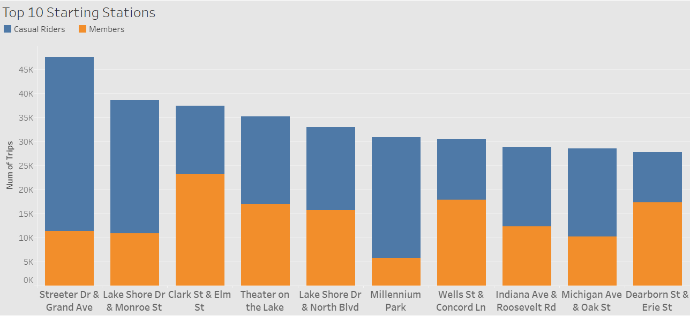

# Cyclists Data Analysis Project

## Overview
This project analyzes data from Cyclists, a bike-sharing company located in California, USA. The goal is to understand customer behavior using limited data to inform marketing strategies and business decisions.

## Table of Contents
1. [Project Description](#project-description)
2. [Data Analysis Process](#data-analysis-process)
3. [Key Findings](#key-findings)
4. [Tools Used](#tools-used)
5. [Visualizations](#visualizations)
6. [Conclusions](#conclusions)
7. [Contact Information](#contact-information)

## Project Description
Cyclists, a bike-sharing company, wants to gain insights into their customers' behavior to apply targeted marketing strategies. This project analyzes approximately 5 million trips over a one-week period to extract meaningful patterns and trends.

## Data Analysis Process
1. Plan
2. Prepare
3. Process
4. Analyze
5. Act

## Key Findings
The analysis focused on several key aspects:
- Trip volumes by month
- Trip distribution during day hours
- Customer type percentages
- Top stations in use
- Favorite weekdays for rides
- Most popular bike types

## Tools Used
- Excel: For initial data editing and cleaning
- Programming: To connect various software tools
- Tableau: For building and sharing visualizations
- MSSQL: For storing and manipulating data

## Visualizations
The project includes several visualizations to represent the findings:

1. 
2. 
3. 
4. 
5. 
6. 
7. 
8. 

## Conclusions
1. Seasons: Summer season shows the highest activity
2. Daily Hours: There's a need to provide more bikes during peak hours
3. Stations: Certain stations require more service and offers
4. Market: Marketing strategies should focus on increasing membership

## Contact Information
- Name: MD, NASSIF
- Email: nasef2002@hotmail.com
- Phone: +966590244069

For more information about this project or to discuss potential collaborations, please feel free to reach out.
